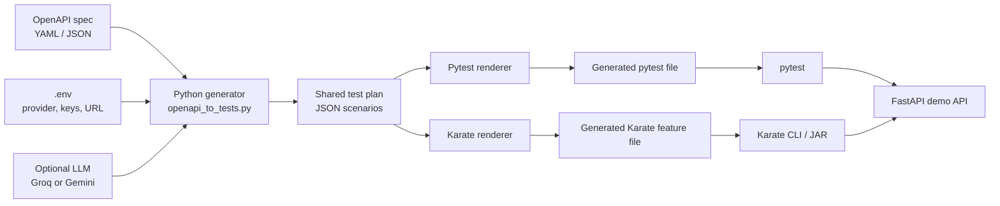

# Component graph

```mermaid
flowchart LR
  Spec["OpenAPI spec<br/>YAML / JSON"]
  Config[".env<br/>provider, keys, URL"]
  Generator["Python generator<br/>openapi_to_tests.py"]
  Plan["Shared test plan<br/>JSON scenarios"]
  LLM["Optional LLM<br/>Groq or Gemini"]
  PyRenderer["Pytest renderer"]
  KarateRenderer["Karate renderer"]
  Pytests["Generated pytest file"]
  Features["Generated Karate feature file"]
  API["FastAPI demo API"]
  PytestRun["pytest"]
  KarateRun["Karate CLI / JAR"]

  Spec --> Generator
  Config --> Generator
  LLM --> Generator
  Generator --> Plan
  Plan --> PyRenderer --> Pytests --> PytestRun --> API
  Plan --> KarateRenderer --> Features --> KarateRun --> API
```
