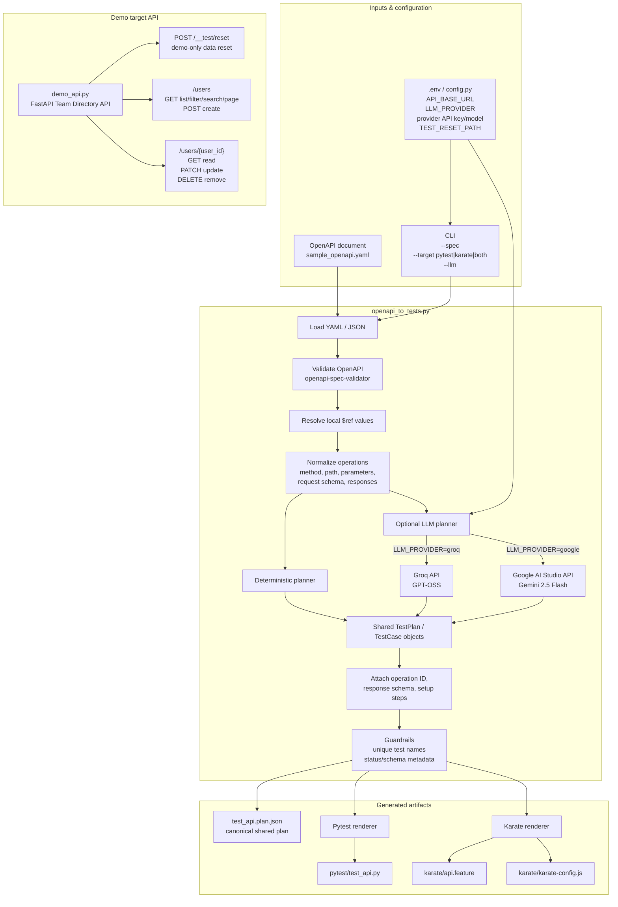

# Project architecture

```mermaid
flowchart TB
  subgraph Inputs["Inputs & configuration"]
    Spec["OpenAPI document<br/>sample_openapi.yaml"]
    Env[".env / config.py<br/>API_BASE_URL<br/>LLM_PROVIDER<br/>provider API key/model<br/>TEST_RESET_PATH"]
    CLI["CLI<br/>--spec<br/>--target pytest|karate|both<br/>--llm"]
  end

  subgraph Generator["openapi_to_tests.py"]
    Load["Load YAML / JSON"]
    Validate["Validate OpenAPI<br/>openapi-spec-validator"]
    Resolve["Resolve local $ref values"]
    Normalize["Normalize operations<br/>method, path, parameters,<br/>request schema, responses"]
    Deterministic["Deterministic planner"]
    LLM["Optional LLM planner"]
    Groq["Groq API<br/>GPT-OSS"]
    Gemini["Google AI Studio API<br/>Gemini 2.5 Flash"]
    Plan["Shared TestPlan / TestCase objects"]
    Enrich["Attach operation ID,<br/>response schema, setup steps"]
    Guard["Guardrails<br/>unique test names<br/>status/schema metadata"]
  end

  subgraph Artifacts["Generated artifacts"]
    PlanJson["test_api.plan.json<br/>canonical shared plan"]
    PyRenderer["Pytest renderer"]
    KarateRenderer["Karate renderer"]
    PyFile["pytest/test_api.py"]
    Feature["karate/api.feature"]
    KarateConfig["karate/karate-config.js"]
  end

  subgraph DemoApi["Demo target API"]
    FastAPI["demo_api.py<br/>FastAPI Team Directory API"]
    Reset["POST /__test/reset<br/>demo-only data reset"]
    Users["/users<br/>GET list/filter/search/page<br/>POST create"]
    UserId["/users/{user_id}<br/>GET read<br/>PATCH update<br/>DELETE remove"]
  end

  Spec --> Load
  Env --> CLI
  CLI --> Load
  Load --> Validate --> Resolve --> Normalize
  Normalize --> Deterministic --> Plan
  Normalize --> LLM
  Env --> LLM
  LLM -->|"LLM_PROVIDER=groq"| Groq --> Plan
  LLM -->|"LLM_PROVIDER=google"| Gemini --> Plan
  Plan --> Enrich --> Guard
  Guard --> PlanJson
  Guard --> PyRenderer --> PyFile
  Guard --> KarateRenderer --> Feature
  KarateRenderer --> KarateConfig
  FastAPI --> Reset
  FastAPI --> Users
  FastAPI --> UserId
```
